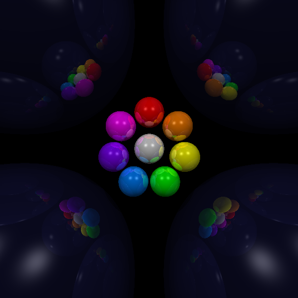

# Java Ray Tracer

A simple ray tracer written in Java that renders scenes composed of spheres
with ambient, diffuse, specular lighting and recursive reflections.
The program outputs images in PPM (P3) format.

---

## Features
- Sphere intersection and shading
- Ambient, diffuse, and specular lighting
- Shadow rays
- Recursive reflections
- Scene description via text input file


## Sample Render




## Dependencies
 
- **Java** (JDK 8 or later)
- **[JAMA](https://math.nist.gov/javanumerics/jama/)** — Java Matrix library, used for matrix/vector operations
  
---
 
## Building
 
```bash
javac RayTracer.java
```

---
 
## Running
 
```bash
java RayTracer <input_file>
```
 
Where `<input_file>` is a scene description file (see format below).
 
---
 
## Input File Format
 
Each line begins with a keyword followed by its parameters:
 
| Keyword   | Parameters                                                                                          | Description                          |
|-----------|-----------------------------------------------------------------------------------------------------|--------------------------------------|
| `NEAR`    | `n`                                                                                                 | Near plane distance                  |
| `LEFT`    | `l`                                                                                                 | Left bound of view frustum           |
| `RIGHT`   | `r`                                                                                                 | Right bound of view frustum          |
| `BOTTOM`  | `b`                                                                                                 | Bottom bound of view frustum         |
| `TOP`     | `t`                                                                                                 | Top bound of view frustum            |
| `RES`     | `width height`                                                                                      | Image resolution in pixels           |
| `SPHERE`  | `name x y z sx sy sz r g b ka kd ks kr n`                                                          | Sphere definition (see below)        |
| `LIGHT`   | `name x y z ir ig ib`                                                                               | Point light source                   |
| `BACK`    | `r g b`                                                                                             | Background colour                    |
| `AMBIENT` | `r g b`                                                                                             | Global ambient light intensity       |
| `OUTPUT`  | `filename`                                                                                          | Output PPM filename                  |
 
### SPHERE Parameters
 
| Parameter | Description                        |
|-----------|------------------------------------|
| `name`    | Identifier                         |
| `x y z`   | Position                           |
| `sx sy sz`| Scale (creates ellipsoids)         |
| `r g b`   | Surface colour (0–1)               |
| `ka`      | Ambient coefficient                |
| `kd`      | Diffuse coefficient                |
| `ks`      | Specular coefficient               |
| `kr`      | Reflection coefficient             |
| `n`       | Specular exponent (shininess)      |
 
### Example Input File
 
```
NEAR 1
LEFT -1
RIGHT 1
BOTTOM -1
TOP 1
RES 600 600
 
SPHERE s1  0.0  0.0 -10.0  2.0  2.0  2.0  0.5  0.2  0.8  0.2  0.7  0.5  0.3  16
SPHERE s2  3.0 -1.0  -8.0  1.0  1.0  1.0  0.8  0.3  0.1  0.2  0.6  0.6  0.1  32
 
LIGHT l1  5.0  5.0  -3.0  0.9  0.9  0.9
 
BACK    0.1 0.1 0.1
AMBIENT 0.2 0.2 0.2
OUTPUT  output.ppm
```
 
---
 
## Output
 
The rendered image is saved as a **P3 PPM** file at the path specified by `OUTPUT`. You can convert it to PNG or other formats using tools like [ImageMagick](https://imagemagick.org/):
 


