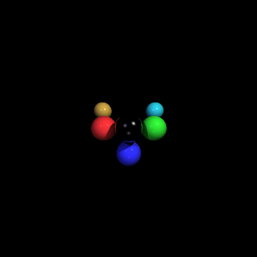

# Java Ray Tracer

A simple ray tracer written in Java that renders scenes composed of spheres
with ambient, diffuse, specular lighting and recursive reflections.
The program outputs images in PPM (P3) format.
---

## Features
- Sphere intersection and shading
- Ambient, diffuse, and specular lighting
- Shadow rays
- Recursive reflections
- Scene description via text input file

---

## Sample Renders




---

## How to Run

### Compile
```bash
javac RayTracer.java jama/*.java
